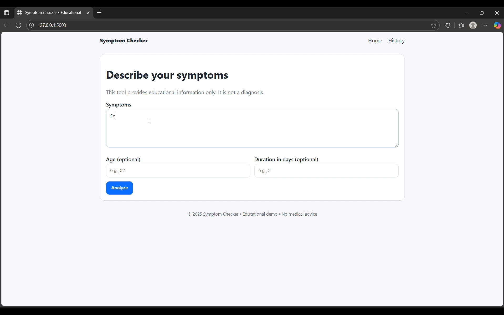

# Symptom Checker 

> **This tool is for education only. It is not a diagnosis and is not a medical device.**  
> Call emergency services for severe, sudden, or worsening symptoms.

## What it does
- Accepts **symptom text** (plus optional age, duration).
- Returns **possible conditions**, **recommended next steps**, and **red flags**.
- Enforces a **strict JSON contract** from the LLM, validates it, and adds **server-side triage**.
- Optional **history** stored locally in SQLite (see `/history`).

## Architecture
- **Flask** app (UI + API)
- **Ollama** local LLM (default: `qwen2.5:7b-instruct-q4_K_M`)
- **Pydantic** schema validation
- **Safety rails**: prompt constraints + JSON schema + triage rules + disclaimer
- Simple **SQLite** for history (no PII beyond what you submit)

## Setup
1) Install [Ollama](https://ollama.com) and pull a model:
```

ollama pull qwen2.5:7b-instruct-q4_K_M

```
2) Create a virtual env and install deps:
```

python -m venv .venv

# Windows: .venv\Scripts\activate

# macOS/Linux: source .venv/bin/activate

pip install -r requirements.txt

```
3) Configure:
```

cp .env.example .env

# edit MODEL_NAME if you prefer (e.g., llama3.1:8b-instruct-q4_K_M)

```
4) Run:
```

python -m src.app

```
Visit **http://localhost:5003**

## API
```

POST /api/analyze
Content-Type: application/json
{
"symptoms": "Fever 2 days, sore throat, cough",
"age": 22,
"duration_days": 2
}

````
**Response**
```json
{
  "conditions": [ { "name": "string", "likelihood_note": "string", "evidence": [] } ],
  "next_steps": ["string"],
  "red_flags": ["string"],
  "disclaimer": "string",
  "raw_model_output": "string|null"
}
````

## History 

* A simple `/history` page shows the last 50 requests.
* Stored in `symptom_history.db` (local file). Delete the file to clear history.

## Demo video 


[]([https://youtu.be/Y23PoOnok5E](https://www.youtube.com/watch?v=TgpGvGHoU6k))

## Testing

```
pytest -q
```

## Disclaimer

* Do not rely on this for medical decisions.


